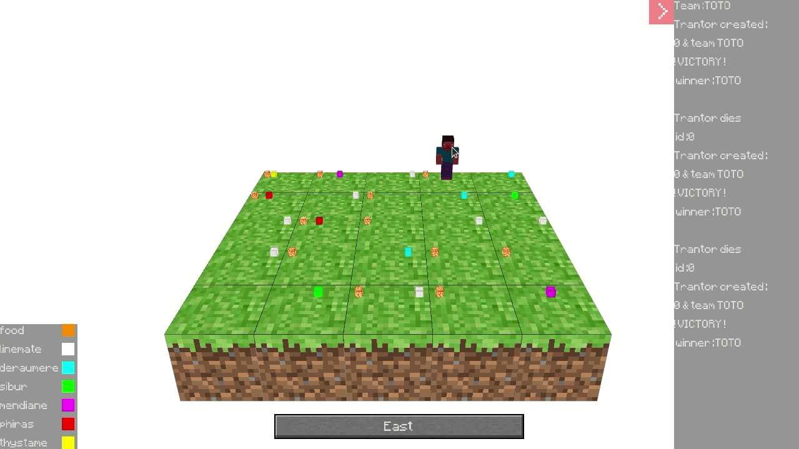

# B-YEP-410-LIL-4-1-zappy-maxime.deroulou

Projet réseau Epitech (C, Socket Unix) dans un monde dans lequel
de IA doivent récolter des ressources (C++, IA), accompagné par 
un GUI 3D (C++, raylib).

Groupe : 6 personnes

